<div align="center">

<br><br>

# 🧠 SENTIO
## *Think Better, Not Just Feel Better*

### Cognitive Bias Self‐Awareness Through Structured Dialogue, Journaling & AI

<br>

**Your personal clarity engine:** Identify the cognitive biases shaping your decisions, conversations, and self-image. Built with **Claude AI**, **three-tier memory**, and **Socratic dialogue**—not generic platitudes, but genuine insight.

<br>

[](https://vuejs.org)
[](https://fastapi.tiangolo.com)
[](https://supabase.com)
[](https://anthropic.com)
[](https://python.org)
[](LICENSE)

<br>

### 🚀 **Live Demos**
[**sentio-go.vercel.app**](https://sentio-go.vercel.app) &nbsp; · &nbsp; [**API Docs**](https://mozoj4-sentio-backend.hf.space/docs) &nbsp; · &nbsp; [**Interview Prep Guide**](INTERVIEW_PREP.md)

<br><br>

</div>

---

## Overview

Sentio is a full-stack mental clarity platform that helps users identify and move past the cognitive biases shaping their decisions, conversations, and self-image. Rather than giving pre-packaged insights, Sentio puts users through the process : structured dialogue, reflective journaling, and validated assessments : so the understanding they reach is genuinely their own.

Two modes of AI interaction: a **context-aware guide** grounded in your personal bias history and journal themes, and a **Socratic engine** that never gives direct answers : only better questions.

---

## 📸 UI Tour

<div align="center">

### Dashboard


### AI Guide with Three-Tier Memory
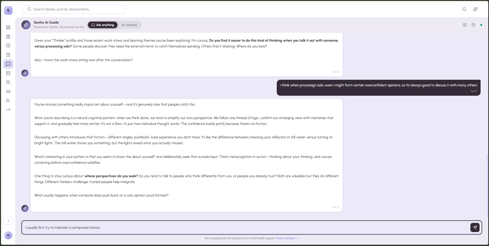

### AI Memory Panel (GDPR Delete)
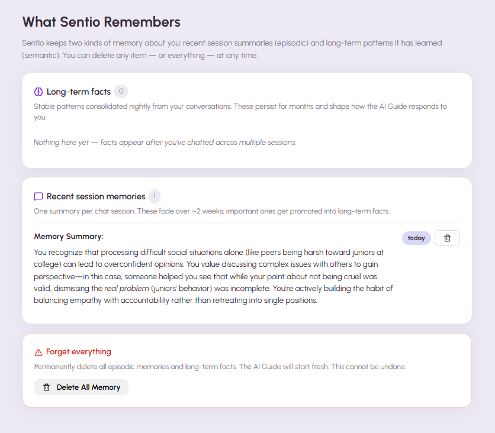

### Markdown Journal with Live Bias Detection
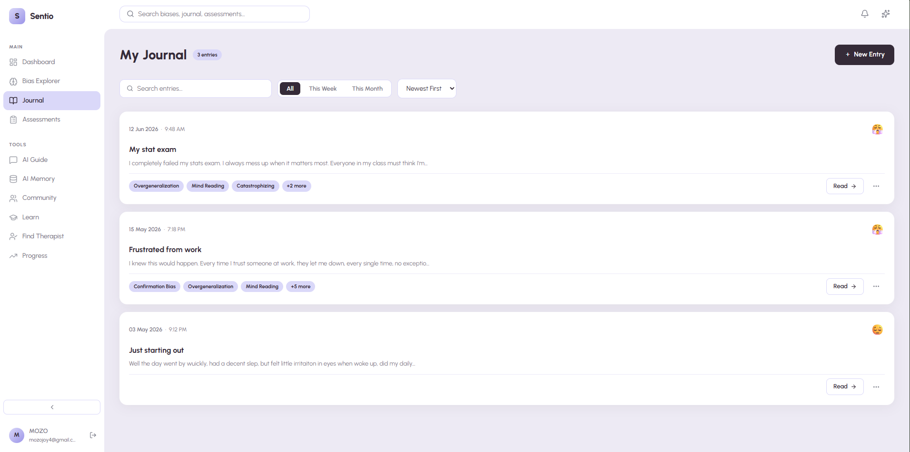

### Journal Analysis Report
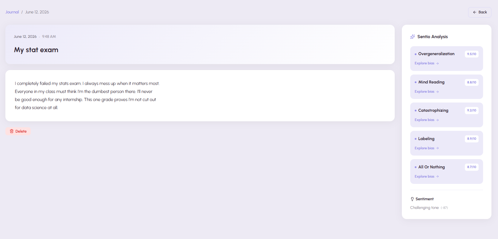

### Socratic Dialogue (7 Algorithms)
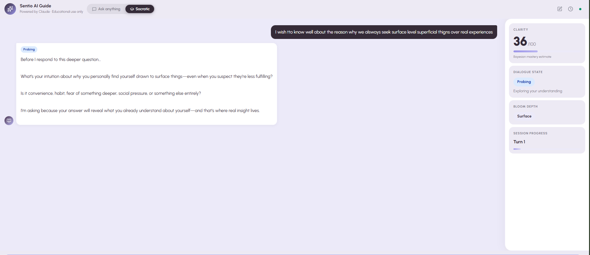

### Socratic Insight Card (Exportable)
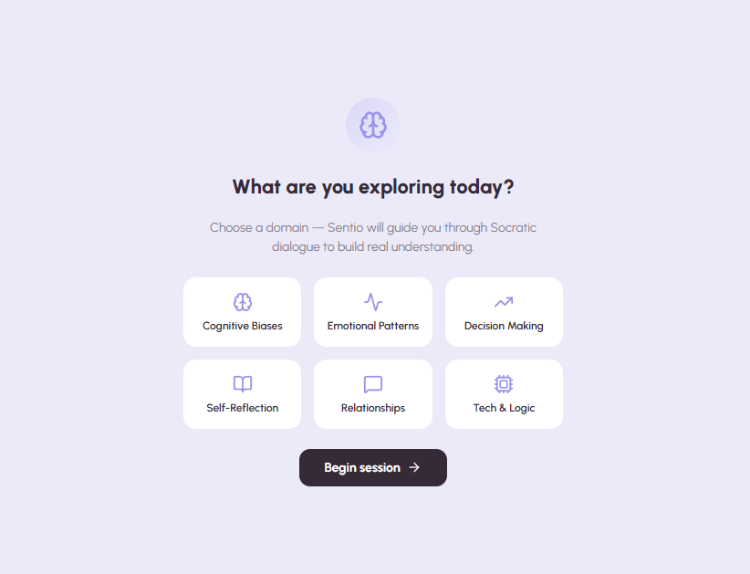

### Cognitive Assessments
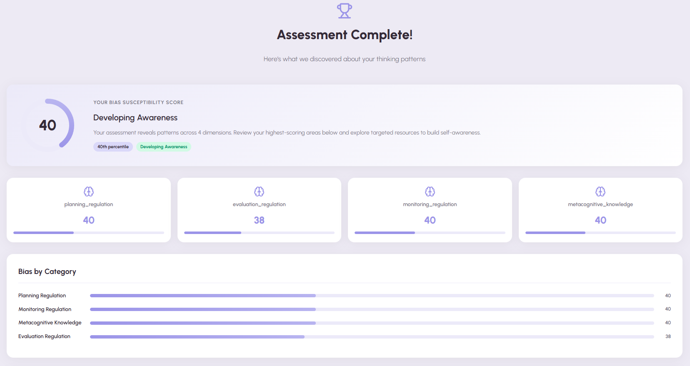

### Learn — Psychology Knowledge Base (RAG)
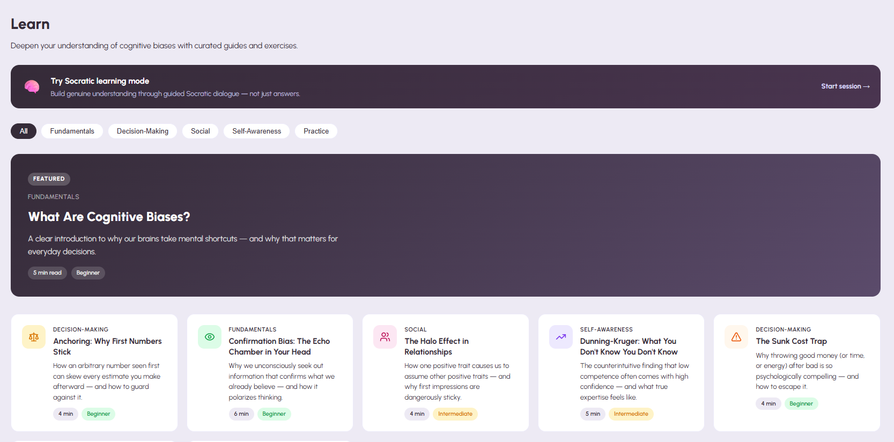

### Bias Explorer — 15-Class Taxonomy
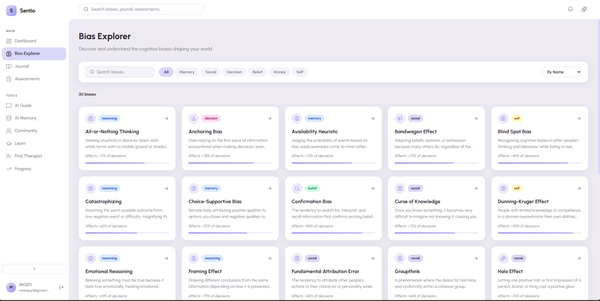

### Progress Tracking
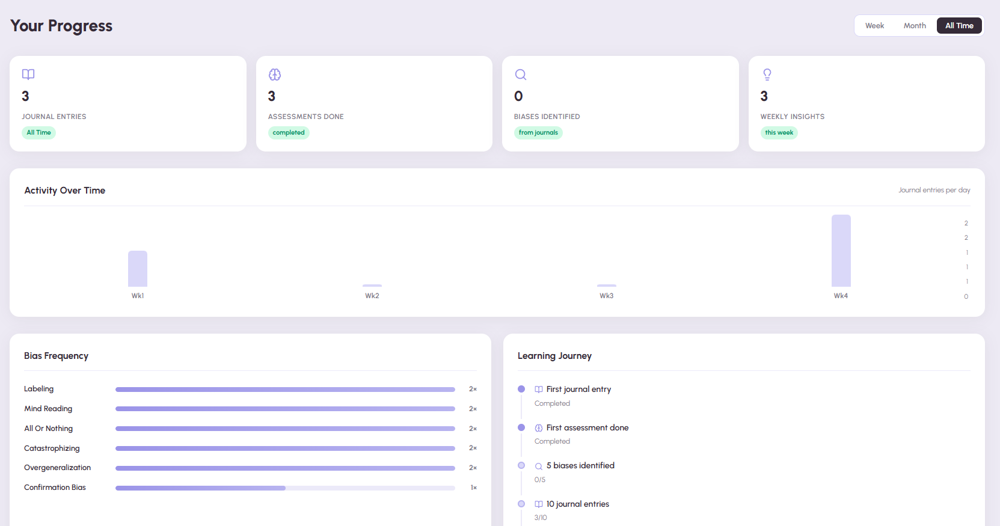

### Community Forums
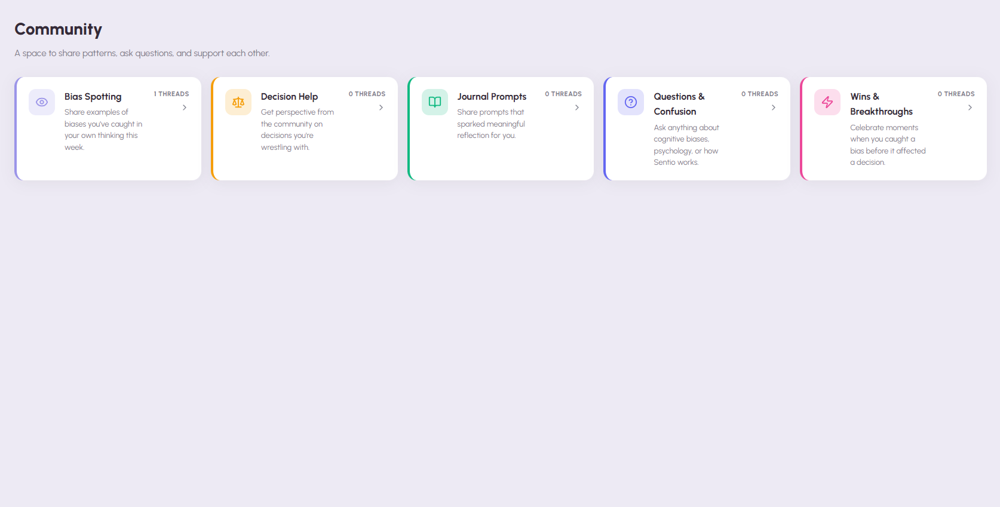

### Therapist Directory (Geo-filtering)
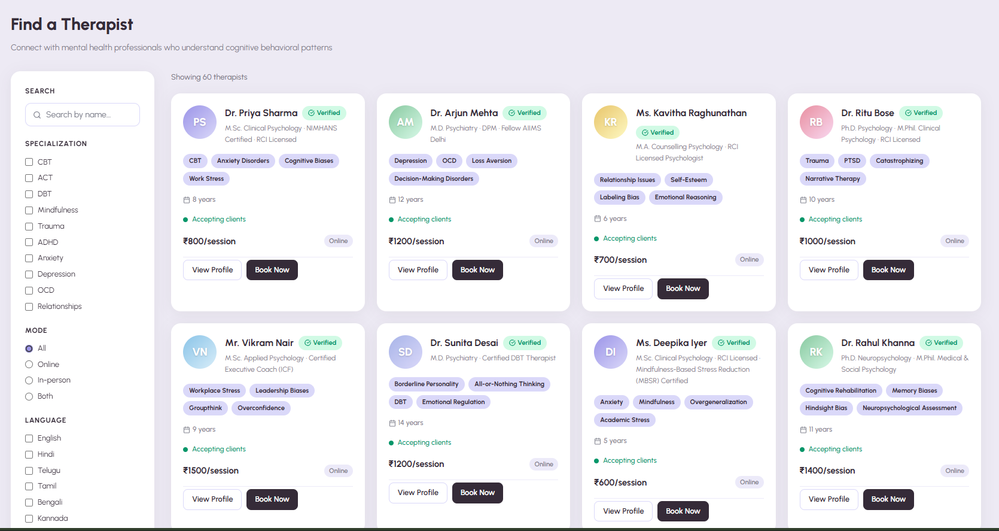

### Authentication
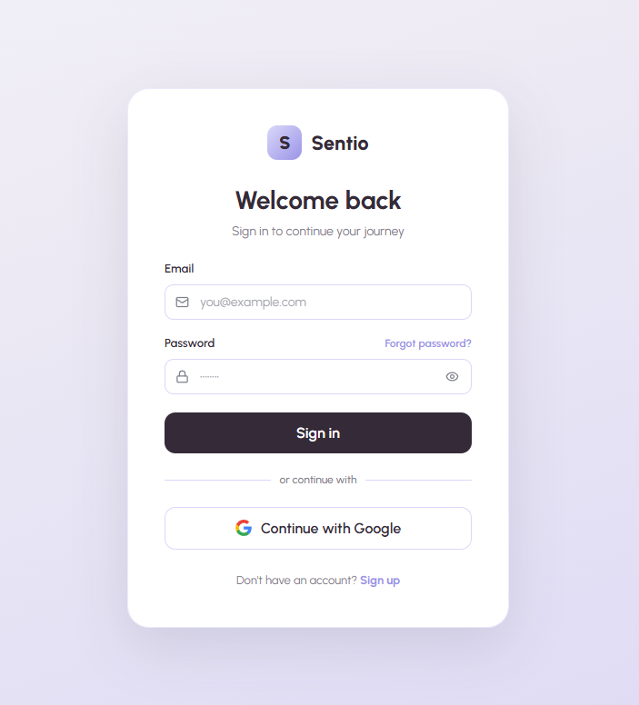

</div>

---

## Why Sentio?

| Problem | Solution |
|---------|----------|
| **Generic insights** | Every response is personalized with *your* bias history, journal themes, and psychology knowledge |
| **Passive learning** | Active Socratic dialogue—no direct answers, only better questions |
| **Scattered data** | Single platform: journal, assessments, AI guide, memory, community, therapist directory |
| **Privacy concerns** | Full transparency: `/memory` page shows everything; one-click GDPR wipe |
| **Cognitive biases are real** | 15-class taxonomy rooted in CBT, validated assessments (GAD-7, PHQ-9) |
| **Black-box AI** | Measurable evals: RAG precision, bias classifier F1, model comparisons in repo |

---

## Features

### AI Guide : RAG-enhanced chat

Streams responses from Claude via SSE. Every message is enriched with three layers of context injected into the system prompt:

- **Bias fingerprint** : top detected biases from assessments + journal, blended 60/40
- **Journal themes** : extracted from recent entries, cached 5 min per user
- **RAG knowledge** : top-3 retrieved chunks from a psychology knowledge base (see pipeline below)

Conversation history persists to Supabase and is reloadable from a history panel. A safety gate intercepts crisis language before any token is spent.

Three-tier memory makes the guide remember you across sessions: per-session episodic summaries and nightly-consolidated semantic facts are retrieved with decay-weighted scoring and injected into every prompt. A dedicated **AI Memory page** (`/memory`) shows everything Sentio remembers, with per-item delete and a full GDPR wipe.

---

### Socratic Mode : seven-algorithm dialogue engine

Ported from [Episteme](https://github.com/mozoj4/episteme). All seven algorithms run **client-side in TypeScript** : zero added round-trip latency. Computed signals are sent with each API call to enrich Claude's prompt server-side.

| Algorithm | Role |
|:----------|:-----|
| **RDSE** : Reasoning Depth Scoring Engine | Scores response quality from logical connectives, uncertainty markers, and Bloom taxonomy verb patterns |
| **SDSM** : Socratic Dialogue State Machine | 7-state FSM: `PROBE → DEEPEN → SCAFFOLD → RECTIFY → REDIRECT → CONSOLIDATE → COMPLETE` |
| **CBKT-CS** : Continuous Bayesian Knowledge Tracing | 4-parameter BKT; updates mastery probability `P(learned)` after every turn |
| **BGDC** : Bloom's Growth Depth Classifier | Maps each response to a Bloom's taxonomy level via domain keyword classification |
| **CPGAB** : Concept-Progress Gap Analysis & Bridging | Tracks concepts covered per domain; infers knowledge gaps |
| **EGP** : Engagement & Gap Prioritisation | Retention decay + gap urgency scoring for adaptive next-step prompting |
| **SM-2** : Spaced Repetition Scheduler | SM-2 interval scheduling for concept reinforcement over time |

Clarity score (BKT), dialogue state, Bloom depth, and session progress are displayed in real time. Completed sessions generate exportable **insight cards** (Markdown, PDF, clipboard).

---

### Journal : markdown-native, live bias detection

- Write / Preview toggle : raw markdown ↔ rendered GFM
- Formatting toolbar : Bold, Italic, Heading, List, Code, Quote; `Ctrl+B`, `Ctrl+I`, `Tab`
- Live bias detection : 15 bias patterns matched as you type, shown inline
- Background AI analysis : sentiment, themes, bias classification via APScheduler (non-blocking)
- AI reflection questions : 3 Claude-generated questions grounded in your specific entry and detected biases
- Full GFM rendering in saved entries

---

### Cognitive Assessments

Validated self-assessment instruments. Results update `user_bias_profiles.bias_scores` using a 60% assessment / 40% journal blend. Scores feed into the AI Guide's context across all sessions.

---

### Bias Explorer

30+ cognitive biases with definition, real-world examples, detection strategies, and cross-links to your own journal entries where each pattern appeared.

---

### Therapist Directory

**Desktop:** 240px sticky sidebar : search, specialisation checkboxes, mode radio, language, availability.
**Mobile:** sidebar hidden entirely; replaced by a horizontal chip strip : each chip opens a dropdown panel for its filter. Active filter reflected in chip label and fill colour.

---

### Community

Threaded discussion boards (topic → thread → replies).

---

### Progress

Longitudinal view of clarity score, bias frequency trends, assessment history, and weekly AI-synthesised insights.

---

## Architecture

```
Browser  (Vue 3 + Pinia)
│
├── Client-side algorithm layer  (TypeScript : runs in browser, zero extra latency)
│      RDSE · SDSM · CBKT-CS · BGDC · CPGAB · EGP · SM-2
│
└── FastAPI  (Python 3.11 : HuggingFace Spaces Docker, port 7860)
       │
       ├── /ai          SSE streaming guide chat (three-tier memory: episodic → semantic → working)
       │    └── GET/DELETE /ai/memory  episodic + semantic memory panel
       ├── /socratic    SSE Socratic dialogue + session persistence
       ├── /journal     CRUD · APScheduler background analysis
       ├── /assessments quiz submit → bias profile update
       ├── /biases      library CRUD
       ├── /insights    weekly AI synthesis
       ├── /community   topics · threads · replies
       ├── /therapists  directory + filters
       └── /users       profile · notifications
              │
              └── Supabase  (PostgreSQL · pgvector · RLS · Auth · Realtime)
```

### RAG Pipeline

```
User message
     │
     ▼  encode()
all-MiniLM-L6-v2              ← sentence-transformers, 384-dim, pre-warmed at startup
     │
     ▼  cosine similarity ≥ 0.65
pgvector match_knowledge RPC  ← top-10 chunks
     │
     ▼  cross-encoder rerank
Cohere rerank-english-v2.0    ← optional; top-3 selected (skipped if no COHERE_API_KEY)
     │
     ▼  injected into Claude system prompt
SSE stream → client
```

### Bias Classification Pipeline

```
Journal save
     │
     ▼  APScheduler background task (non-blocking)
claude-haiku-4-5-20251001
   system: 15-class taxonomy  ← cache_control: ephemeral (prompt-cached)
   input:  entry text ≤ 3000 chars
   output: [{bias_id, confidence, span}]
     │
     ▼
journal_entries.detected_biases  (jsonb)
     │
     ▼  60% assessment + 40% journal blend
user_bias_profiles.bias_scores   (jsonb)
```

### Safety Gate

| Stage | Mechanism |
|:------|:----------|
| **Input check** | Keyword match against 20 crisis signals : if matched, returns HTTP 422 with India crisis helplines (iCall 9152987821, Vandrevala 1860-2662-345); Claude never called |
| **Output filter** | Regex scan of each streamed chunk for clinical overreach (`diagnos*`, disorder/illness/medication phrasing) : matching chunks dropped before forwarding |

---

## Models & ML

| Component | Model / Library | Notes |
|:----------|:----------------|:------|
| AI Guide chat | `claude-haiku-4-5-20251001` default · `claude-sonnet-4-6` optional | Configurable via `CLAUDE_MODEL` env var |
| Socratic dialogue | Same configurable model | ≤120 words per response, ends with one question |
| Journal reflections | Same configurable model | 3 grounded questions per entry |
| Socratic insight cards | Same configurable model | Structured JSON output |
| Bias classifier | `claude-haiku-4-5-20251001` (API, prompt-cached); QLoRA Qwen2.5-3B student (WIP) | Prompt-cached taxonomy ≈ $0.0002/entry |
| Memory embeddings | `all-MiniLM-L6-v2` (reused from RAG) | Episodic + semantic memory retrieval with decay scoring |
| RAG embeddings | `all-MiniLM-L6-v2` (sentence-transformers) | 384-dim dense vectors |
| RAG reranking | Cohere `rerank-english-v2.0` | Optional; pipeline degrades gracefully |
| Journal NLP | Keyword heuristics · optional HF Space endpoint | Sentiment (−1→+1), emotion labels, themes |
| Socratic algorithms | Pure TypeScript : no ML runtime | 7 deterministic algorithms, client-side only |

### Bias Taxonomy (15 classes)

`confirmation_bias` · `attribution_error` · `all_or_nothing` · `catastrophizing` · `mind_reading` · `overgeneralization` · `emotional_reasoning` · `should_statements` · `labeling` · `personalization` · `availability_bias` · `anchoring_bias` · `dunning_kruger` · `sunk_cost_fallacy` · `fundamental_attribution`

---

## Stack

| Layer | Technology |
|:------|:-----------|
| Frontend | Vue 3 · Vite · Pinia · Vue Router 4 · Lucide Vue · Urbanist |
| Markdown | `marked` (GFM + line breaks) |
| Backend | FastAPI · Python 3.11 · Pydantic v2 (`[email]` extra) · APScheduler |
| AI | Anthropic Claude async streaming SDK |
| Embeddings | sentence-transformers `all-MiniLM-L6-v2` |
| Reranking | Cohere `rerank-english-v2.0` (optional) |
| Vector search | Supabase pgvector : `match_knowledge` RPC |
| Database | Supabase PostgreSQL · Row-Level Security · Realtime |
| Auth | Supabase email/password + Google OAuth |
| Email | Resend (transactional) |
| Deployment | HuggingFace Spaces Docker · Vercel |

---

## Project Structure

```
sentio/
├── src/
│   ├── assets/css/main.css               ← CSS tokens: --plum · --lavender · --slate · --bg · --radius · --shadow
│   ├── composables/useSupabase.js        ← Supabase client singleton
│   ├── api/client.js                     ← Axios instance with auto Bearer injection
│   ├── stores/
│   │   ├── auth.js                       ← signIn · signUp · signInWithOAuth · signOut · ensureInitialized
│   │   ├── user.js · bias.js · journal.js · assessment.js · insights.js · therapist.js
│   ├── layouts/
│   │   ├── DefaultLayout.vue             ← Sidebar 220px/56px desktop · fixed drawer on mobile <640px
│   │   │                                    White topbar · hamburger · notifications · global search
│   │   ├── AuthLayout.vue                ← Centered card (full-screen on phones)
│   │   └── OnboardingLayout.vue
│   ├── pages/
│   │   ├── Dashboard.vue                 ← Stats · radar chart · bias fingerprint · insights · quick actions
│   │   ├── AIGuide.vue                   ← Guide + Socratic chat · SSE · history panel
│   │   ├── Progress.vue · Profile.vue · Learn.vue · Admin.vue
│   │   ├── journal/   Index.vue · New.vue · Entry.vue
│   │   ├── explore/   Index.vue · BiasDetail.vue
│   │   ├── assessments/   Index.vue · Take.vue · Results.vue
│   │   ├── community/   Index.vue · Topic.vue · Thread.vue
│   │   ├── therapists/   Index.vue · Profile.vue
│   │   └── auth/   Login.vue · Signup.vue
│   └── lib/episteme/
│       ├── algorithms.ts                 ← All 7 Socratic algorithms : pure TS, no dependencies
│       ├── prompts.ts                    ← Prompt builders
│       └── types.ts
│
└── sentio-api/
    ├── main.py                           ← FastAPI app · CORS · lifespan (pre-warms embedder)
    ├── Dockerfile                        ← Port 7860 · downloads NLTK + MiniLM at build
    ├── README.md                         ← HF Spaces YAML (sdk: docker, app_port: 7860)
    ├── requirements.txt
    ├── routers/
    │   ├── _auth_helpers.py              ← Direct httpx → Supabase /auth/v1/user (avoids gotrue 401s)
    │   ├── ai.py                         ← /ai/chat SSE · /ai/chat/history · 5-min context cache
    │   ├── socratic.py                   ← /socratic/chat SSE · session CRUD
    │   ├── journal.py · assessments.py · biases.py · insights.py
    │   ├── community.py · therapists.py · users.py · auth.py · admin.py
    └── services/
        ├── claude_service.py             ← All Claude wrappers (guide · Socratic · reflections · insight cards)
        ├── rag_service.py                ← Embed → pgvector → Cohere rerank → context string
        ├── bias_classifier.py            ← Haiku + 15-class taxonomy + prompt caching
        ├── journal_nlp.py                ← Sentiment/themes (HF endpoint with local fallback)
        ├── safety.py                     ← Crisis input check · clinical overreach output filter
        ├── scheduler.py · recommender.py · badge_engine.py · email_service.py · supabase_client.py
```

---

## Database (Supabase)

| Table | Purpose |
|:------|:--------|
| `profiles` | Display name, avatar, onboarding state |
| `user_bias_profiles` | `bias_scores` jsonb : 60% assessment / 40% journal blend |
| `journal_entries` | Content, sentiment, detected_biases, analysis_status (`'pending'`\|`'processing'`\|`'done'`\|`'failed'`) |
| `knowledge_articles` | Psychology KB with `embedding vector(384)` for pgvector |
| `cognitive_assessments` | Assessment definitions and questions |
| `assessment_submissions` | User answers and computed scores |
| `cognitive_biases` | 30+ bias entries : definition, examples, detection signals |
| `therapists` | Directory : specialisations, lat/lng, mode, availability |
| `community_topics` / `community_threads` / `community_replies` | Forum |
| `notifications` | Notification feed |
| `socratic_sessions` | Session state + full conversation history |
| `memory_episodes` | Per-session episodic memory with pgvector embeddings + decay scoring |
| `user_facts` | Semantic long-term user facts (consolidated nightly from episodes) |
| `badges` / `user_badges` | Achievement system |

All tables have Row-Level Security tied to `auth.uid()`.

---

## Engineering Notes

**Auth** : `get_user_id()` calls `{SUPABASE_URL}/auth/v1/user` directly via `httpx` instead of the gotrue Python client. The singleton caches stale state and produces spurious 401s; the direct call is stateless.

**Streaming** : Guide: `data: {"chunk": "..."}` / `data: [DONE]`. Socratic: `data: {"text": "..."}` / `data: {"done": true}`. Safety output filter runs on every chunk before forwarding.

**Context cache** : `_USER_CTX_CACHE` dict in `ai.py` stores `(bias_fingerprint, journal_themes)` per user with 5-min TTL, eliminating 2 DB calls per AI message.

**Prompt caching** : Bias classifier's 15-class taxonomy marked `cache_control: ephemeral`. Anthropic caches this prefix across calls (~$0.0002/entry).

**Background tasks** : APScheduler runs bias classification and embedding generation post-save, keeping journal write latency under 200ms.

**Three-tier memory** : Working memory = 5-min `_USER_CTX_CACHE`; Episodic = one `memory_episodes` row per session (Claude Haiku summary + MiniLM embedding + decay score = cosine × exp(−λ×age) × importance); Semantic = nightly consolidation into `user_facts` via APScheduler 02:00 UTC. Retrieval uses `match_memory` pgvector RPC with dual λ (0.05 episodes, 0.005 facts). Cites MemGPT (Packer 2023) and Park et al. generative agents (2023).

**Analysis status** : `journal_entries.analysis_status` tracks pipeline state (`pending` → `processing` → `done`/`failed`). APScheduler `_sweep_orphan_analyses` job runs every 10 min and re-queues entries stuck `pending` > 5 min, recovering from server crashes.

---

## Local Setup

```bash
# Frontend
npm install
cp .env.example .env   # set VITE_SUPABASE_URL, VITE_SUPABASE_ANON_KEY, VITE_API_BASE_URL
npm run dev

# Backend
cd sentio-api
uv venv && .venv\Scripts\activate
uv pip install -r requirements.txt
cp .env.example .env   # fill in all keys
uvicorn main:app --reload --port 8000

# Database : run once in Supabase SQL Editor (in order)
# sentio-api/db/migration_phase6.sql            (base schema)
# sentio-api/db/migration_memory.sql            (three-tier memory tables + RPCs)
# sentio-api/db/migration_analysis_status.sql   (analysis_status column + partial index)
```

API docs: `http://localhost:8000/docs`

**Key env vars (backend)**

| Variable | Description |
|:---------|:------------|
| `SUPABASE_URL` / `SUPABASE_SERVICE_KEY` | Supabase project credentials |
| `ANTHROPIC_API_KEY` | Anthropic API key |
| `CLAUDE_MODEL` | Optional model override (default: `claude-haiku-4-5-20251001`) |
| `COHERE_API_KEY` | Optional : enables RAG reranking |
| `ALLOWED_ORIGINS` | CORS origin(s) |
| `RESEND_API_KEY` / `RESEND_FROM_EMAIL` | Transactional email |
| `ADMIN_EMAIL` / `ADMIN_PASSWORD` | Admin dashboard |

---

## Deployment

See [DEPLOY.md](DEPLOY.md) for the full guide.

```bash
# Backend → HuggingFace Spaces
git subtree split --prefix=sentio-api --branch hf-deploy
git push hf-space hf-deploy:main --force
git branch -D hf-deploy

# Frontend → Vercel (auto on push)
git push origin main
```

**Google OAuth** : Enable Google provider in Supabase Auth → Providers. Add `https://[ref].supabase.co/auth/v1/callback` as an authorized redirect URI in Google Cloud Console, and your Vercel domain as an authorized JS origin.

---

## 🚀 Get Started

### Try it now (no signup required)
→ [**sentio-go.vercel.app**](https://sentio-go.vercel.app)

### Deploy your own
```bash
# Frontend → Vercel (click and deploy)
# Backend → HuggingFace Spaces (free GPU, Docker-based)
# Database → Supabase (free tier, 500MB)

# Or local dev:
npm install && npm run dev        # frontend
cd sentio-api && uv sync && uvicorn main:app --reload
```

### For AI/ML engineers
- **Interview Prep Guide**: [INTERVIEW_PREP.md](INTERVIEW_PREP.md) (28 parts, full math + evals)
- **Eval Scripts**: `scripts/eval_rag.py`, `scripts/eval_bias.py`, `scripts/run_all_evals.py`
- **QLoRA Fine-tuning**: `sentio-ml/notebooks/sentio_bias_qlora.ipynb` (Kaggle T4 ready)
- **API Reference**: [mozoj4-sentio-backend.hf.space/docs](https://mozoj4-sentio-backend.hf.space/docs)

### Contributing
Sentio is **open to ideas**: bias taxonomy extensions, new assessments, Socratic algorithm refinements, UI improvements. Open an issue to discuss.

---

<div align="center">

*Built to make thinking clearer. Not a replacement for professional mental health support.*

<br>

[](https://github.com/mozoj4/sentio)
&nbsp;·&nbsp;
[](LICENSE)
&nbsp;·&nbsp;
[Privacy Policy](#) &nbsp;·&nbsp; [Code of Conduct](#)

<br><br>

**Made with ❤️ for people who want to understand themselves better**

</div>
